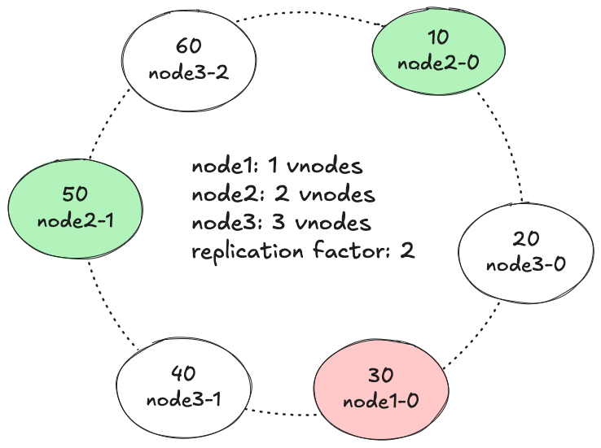
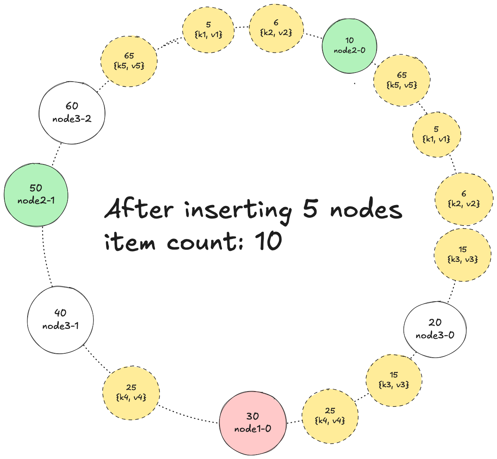
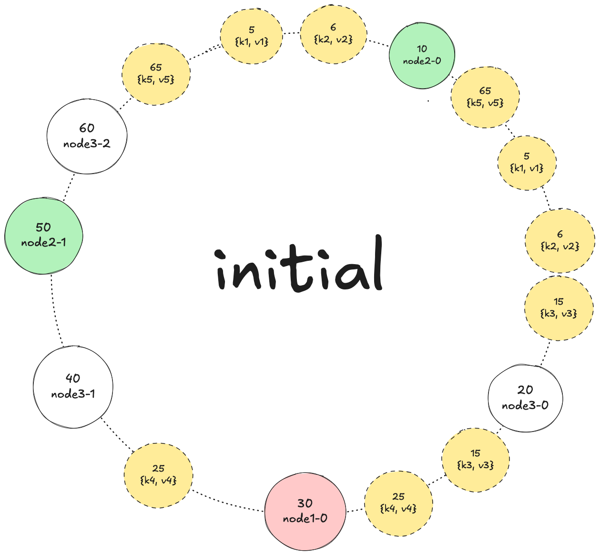
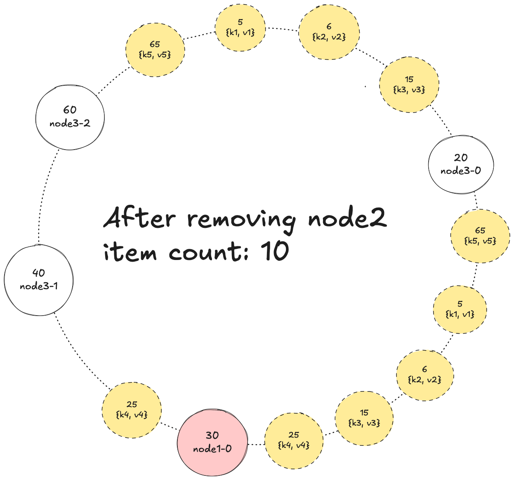
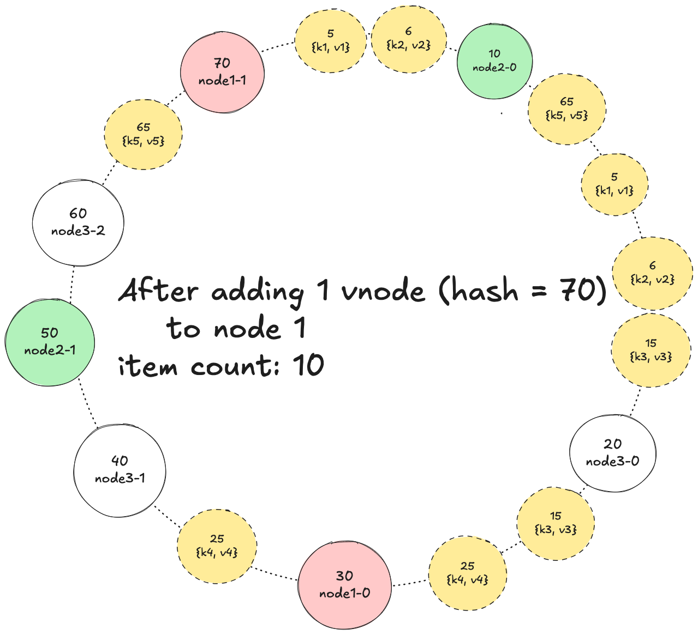
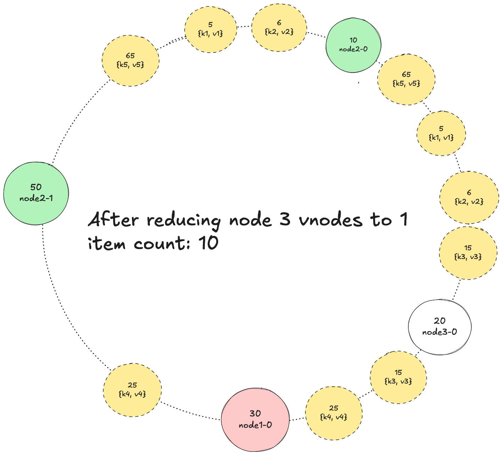
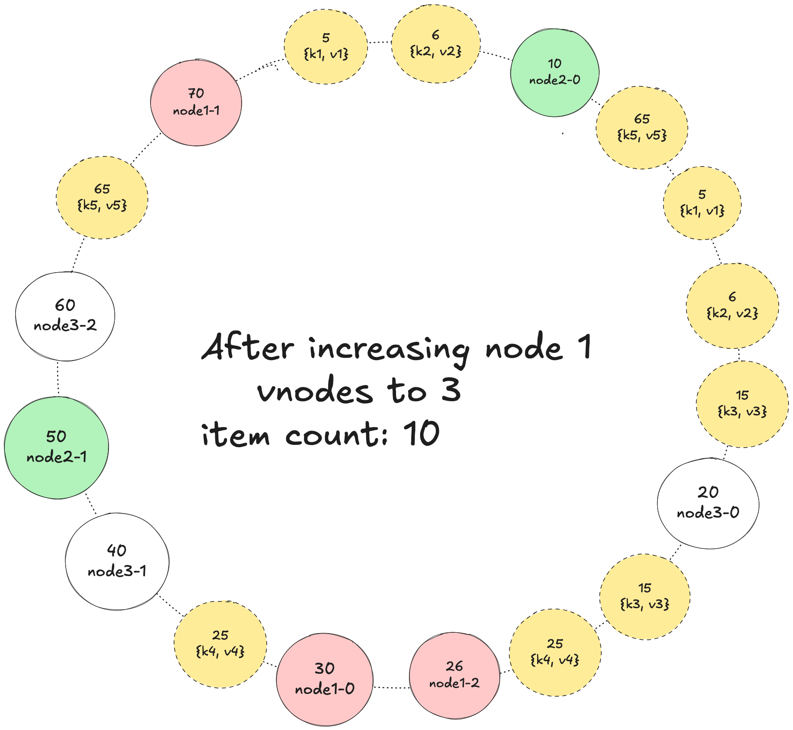

# conhash-ring: Rust implementation of Consistent Hashing

## Overview
This is a Rust implementation of consistent hashing, a technique used in distributed systems to distribute data across multiple nodes in a way that minimizes the amount of data that needs to be moved when nodes are added or removed.

This implementation serves as an educational example to demonstrate the concept of a consistent hash ring. It is not designed for production environments.

## Features
- Support pluggable hash functions.
- Support virtual nodes: Each physical node can be represented by multiple virtual nodes to improve load balancing. Physical nodes contain real data, while virtual nodes contain key hashes.
- Support replication factor: Each key can be stored on multiple physical nodes to improve fault tolerance.

## APIs
Checkout [ConsistentHashingRing](https://docs.rs/conhash-ring/latest/conhash_ring/struct.ConsistentHashingRing.html) for more details.

## Test case examples
Checkout test cases in `src/lib.rs` for more details.

### 1. Add keys

  
  

### 2. Removing node 2 (with 2 vnodes)

  
  

### 3. Adding 1 vnode (hash = 70) to node 1

  
  

### 4. Reducing node 3 vnodes to 1

  
  

### 5. Increasing node 1 vnodes to 3

  
  

